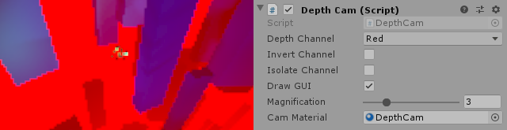

### Drone Collection [Video](https://www.youtube.com/watch?v=MKDBcKNJVS4)

Tricopter, Quadcopter, Hexacopter & Octocopter drones built in Unity. Comes with trained reinforcement models for fixed rotor and tilted rotor control, made with [Unity Machine Learning Agents](https://github.com/Unity-Technologies/ml-agents) [version 0.8.1](https://github.com/Unity-Technologies/ml-agents/releases/tag/0.8.1). 

Includes a depth camera monobehaviour and shader that might be useful for training with visual observations (no pre-trained models yet).

